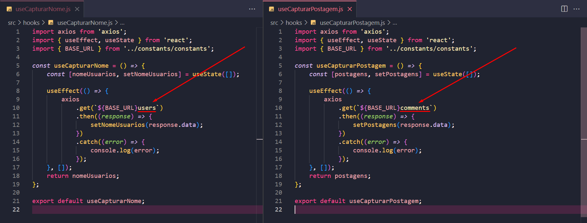

# Template da aula de Custom Hooks

## Índice

-   [1. Prática 1](#1-prática-1)
-   [3. Prática 2](#2-prática-2)
-   [3. Prática 3](#3-prática-3)

## 1 Prática 1

### Enunciado

-   Extraia a lógica das requisições já existentes no template e construa dois custom hooks:
    -   `useCapturarNome` (Custom Hook para Capturar nome das pessoas usuárias)
    -   `useCapturarPostagens` (Custom Hook para Capturar postagens das pessoas usuárias)

### Resolução

-   A ideia é:
    -   Tranportar para um _novo arquivo_ (custom hook) a lógica do arquivo `UserNamesPage.js`, presente antes do retorno da função `UserNamesPage`.
    -   Isso porque o `jsx` tem como objetivo a renderização, e tudo que vem anter do `jsx` é a lógica.
    -   O objetivo é deixar a menor quantidade de lógica possível para uma melhor organização do código e também para que ele seja reutilizável.

---

#### Procedimento -> Hook `useCapturarNome` :

1. Em `src` criei uma pasta chamada `hooks` e dentro dela um arquivo chamado `useCapturarNome.js`;

2. No arquivo `useCapturarNome.js`, criei e exportei uma função chamada `useCapturarNome`:

    ```
    const useCapturarNome = () => {

    };

    export default useCapturarNome;
    ```

3. Transportei toda a **lógica** de `UserNamesPage.js` para dentro da função `useCapturarNome`. É importante não esquecer de importar todos os itens necessários, que nesse caso são: `axios`, `useEffect`, `useState` e a `BASE_URL`;

4. É necessário também que a função `useCapturarNome` me dê um retorno, para que eu possa utiliza-lo onde desejar. Analisando o código, percebo que faz sentido retornar o `nomeUsuarios`, pois quando a requisição funciona chamamos `setNomeUsuarios(response.data)` para setar os valores de `nomeUsuarios`

-   `useCapturarNome.js` possui essa lógica até o momento:

    ```
    import axios from 'axios';
    import { useEffect, useState } from 'react';
    import { BASE_URL } from '../constants/constants';

    const useCapturarNome = () => {
        const [nomeUsuarios, setNomeUsuarios] = useState([]);

        useEffect(() => {
            axios
                .get(`${BASE_URL}users`)
                .then((response) => {
                    setNomeUsuarios(response.data);
                })
                .catch((error) => {
                    console.log(error);
                });
        }, []);
        return nomeUsuarios;
    };

    export default useCapturarNome;
    ```

---

5. Agora irei adaptar o `UserNamesPage.js`.

6. Dentro da função `UserNamesPage` eu importei o retorno da função `useCapturarNome` da seguinte forma:
    ```
    const retornoDaFuncao = useCapturarNome();
    ```
7. E agora eu renderizo esse `retornoDaFuncao` no lugar de `nomeUsuarios`

    ```
    (...)

    import useCapturarNome from '../hooks/useCapturarNome';

    (...)

      const UserNamesPage = () => {

        const retornoDaFuncao = useCapturarNome();

    (...)

        {retornoDaFuncao.map((usuario) => { (...)

    (...)
    ```

    ***

#### Procedimento -> Hook `useCapturarPostagem` :

1.  Em `hooks` criei um arquivo chamado `useCapturarPostagens.js`;

2.  Copiei a **lógica** de `CommentsPages.js` e colei dentro de `useCapturarPostagem.js`, fiz as importações e o retorno, ficando da seguinte forma:

    ```
    import axios from 'axios';
    import { useEffect, useState } from 'react';
    import { BASE_URL } from '../constants/constants';

    const useCapturarPostagem = () => {
        const [postagens, setPostagens] = useState([]);

        useEffect(() => {
            axios
                .get(`${BASE_URL}comments`)
                .then((response) => {
                    setPostagens(response.data);
                })
                .catch((error) => {
                    console.log(error);
                });
        }, []);
        return postagens;
    };

    export default useCapturarPostagem;
    ```

3.  Em `CommentsPage.js`, eu importo e adapto o hook `useCapturarPostagem` para ser renderizado, ficando na seguinte forma:

    ```
    (...)
    import useCapturarPostagem from '../hooks/useCapturarPostagem';

    const CommentsPage = () => {
            const postagens = useCapturarPostagem();

    (...)
            {postagens.map((post) => {

    (...)
    ```

## 2 Prática 2

### Enunciado

-   Utilize o exemplo do `useRequestData` do material assíncrono e reorganize o código da prática 1, de modo a permitir a reutilização da lógica para ambas as requisições ao longo do projeto.

### Resolução

-   Código do `useRequestData` do material assíncrono:

    ```
        import React, {useState, useEffect} from 'react'
        import axios from 'axios'

        export function useRequestData(url, initialState) {
            const [data, setData] = useState(initialState)

            useEffect(() => {
                axios.get(url)
                    .then(response => {
                        setData(response.data)
                })
                    .catch(error => console.log(error.response.data)
            )}, [url])

        return data
        }
    ```

---

-   Analisando os dois `Custom Hooks` criados, percebo que são idênticos e apenas o `path` é diferente neles:
    

-   A ideia agora é: Fazer **UM custom hook genérico** para utilizar nos DOIS casos!

---

#### Procedimento -> Hook `useRequestData` :

1. Em `hooks` criar um arquivo chamado `useRequestData.js`
2. Dentro desse arquivo preciso criar uma função chamada `useRequestData`
3. Dentro da função `useRequestData` eu adapto um custom hook anteriormente criado para algo mais genérico e que _receba_ um `path` como parâmetro, pois essa é a unica coisa que muda, ficando da seguinte forma:

    ```
    import { useEffect, useState } from 'react';
    import { BASE_URL } from '../constants/constants';
    import axios from 'axios';

    const useRequestData = (path) => {
        const [data, setData] = useState([]);

        useEffect(() => {
            axios
                .get(`${BASE_URL}${path}`)
                .then((response) => {
                    setData(response.data);
                })
                .catch((error) => {
                    console.log(error);
                });
        }, []);
        return data;
    };

    export default useRequestData;
    ```

#### Procedimento -> Adaptando `UserNamesPage.js` para receber `useRequestData` :

1. Agora irei substituir o `useCapturanome()` para `useRequestData()`, e preciso passar o parâmetro necessário.
2. `UserNamesPage.js` fica com o seguinte código:

    ```
    import { Title, NameContainer } from '../style';
    import { Card } from '../components/Card/Card';
    import useRequestData from '../hooks/useRequestData';

    const UserNamesPage = () => {
        const retornoDaFuncao = useRequestData('users');
        return (
            <div>
                <Title>Nomes dos usuários</Title>
                <NameContainer>
                    {retornoDaFuncao.map((usuario) => {
                        return (
                            <Card
                                key={usuario.id}
                                text={usuario.name}
                                backgroudColor={'nome'}
                                textColor={'nome'}
                            />
                        );
                    })}
                </NameContainer>
            </div>
        );
    };

    export default UserNamesPage;
    ```

#### Procedimento -> Adaptando `CommentsPage.js` para receber `useRequestData` :

1. Fazendo a mesma adaptação, tenho o seguinte código:

    ```
    import { Title, PostContainer } from '../style';
    import { Card } from '../components/Card/Card';
    import useRequestData from '../hooks/useRequestData';

    const CommentsPage = () => {
        const postagens = useRequestData('comments');

        return (
            <div>
                <Title>Comentários dos usuários</Title>
                <PostContainer>
                    {postagens.map((post) => {
                        return (
                            <Card
                                key={post.id}
                                text={post.body}
                                backgroudColor={'#1dc690'}
                                textColor={'#ffffff'}
                            />
                        );
                    })}
                </PostContainer>
            </div>
        );
    };

    export default CommentsPage;

    ```

2. Agora posso excluir os arquivos: `useCapturarNome.js` e `useCapturarPostagem`, e utilizar um único custom hooks para duas requisições diferentes. (Mas irei deixar esses dois arquivos para poder consultar depois)

## 3 Prática 3

### Enunciado

-   Atualize o `useRequestData` do exercício anterior:
    -   Faça o tratamento de erros: ele deve mostrar uma mesnagem de erro caso a requisição caia no catch.
    -   Adicione um indicador de carregamento: o suário deve saber que os dados estão sendo carregados.
    -   Utilize o nome `isLoading` como variável de estado.

### Resolução

-   Criar um novo estado para acompanhar o estado true ou false do `isLoading`, iniciando como true e depois irá ser setado como false quando parar de carregar:
    ```
    const [isLoading, seIsLoading] = useState(true);
    ```
-   Se a requisição for concluída, logo sera em `then` eu seto para false e em cath tmbm!:
    ```
                .then((response) => {
                    setData(response.data);
                    seIsLoading(false);
                })
                .catch((error) => {
                    console.log(error);
                    seIsLoading(false);
                });
    ```
-   por array, a ordem importa, por obje n ???

-   Em `UserNamesPages.js`

    ```
    const [nomeUsuarios, isLoading] = useRequestData('users');

    ```

(- tRABALHAR COM COLCHETES EU FICO DE OLHO NA POSIÇÃO, N IMPORTA O NOME)

(- AGORA SE EU TRABALHAR COM A {} ..SO DEUS SABE)

-   `useRequestData.js` fica assim:

    ```
    /* eslint-disable react-hooks/exhaustive-deps */
    import { useEffect, useState } from 'react';
    import { BASE_URL } from '../constants/constants';
    import axios from 'axios';

    const useRequestData = (path) => {
        const [data, setData] = useState([]);
        const [isLoading, seIsLoading] = useState(true);

        useEffect(() => {
            axios
                .get(`${BASE_URL}${path}`)
                .then((response) => {
                    setData(response.data);
                    // setTimeout(() => seIsLoading(false), 6000);
                    seIsLoading(false);
                })
                .catch((error) => {
                    console.log(error);
                    seIsLoading(false);
                });
        }, []);
        return [data, isLoading];
    };

    export default useRequestData;
    ```

-   `UserNamePage.js` fica assim:

    ```
    import { Title, NameContainer } from '../style';
    import { Card } from '../components/Card/Card';
    import useRequestData from '../hooks/useRequestData';

    const UserNamesPage = () => {
        const [nomeUsuarios, isLoading] = useRequestData('users');
        return (
            <div>
                <Title>Nomes dos usuários</Title>
                <NameContainer>
                    {isLoading ? (
                        <p>CARREGANDO</p>
                    ) : (
                        nomeUsuarios.map((usuario) => {
                            return (
                                <Card
                                    key={usuario.id}
                                    text={usuario.name}
                                    backgroudColor={'nome'}
                                    textColor={'nome'}
                                />
                            );
                        })
                    )}
                </NameContainer>
            </div>
        );
    };

    export default UserNamesPage;

    ```

-   Agora vamos trabalhar o erro:

    -   Criar um estado em `useRequestData.js`:

    ```
    const [isError, setIsError] = useState(false);

    (...)
            .then((response) => {
                setData(response.data);
                // setTimeout(() => seIsLoading(false), 6000);
                seIsLoading(false);
            })
            .catch((error) => {
                setIsError(true);
            });
    (...)
    return [data, isLoading, isError];
    (...)
    ```

-   Agora em `UserNamesPage.js`, vms colocar uma condicional:

    ```
    import { Title, NameContainer } from '../style';
    import { Card } from '../components/Card/Card';
    import useRequestData from '../hooks/useRequestData';

    const UserNamesPage = () => {
        const [nomeUsuarios, isLoading, isError] = useRequestData('users');
        return (
            <div>
                <Title>Nomes dos usuários</Title>
                <NameContainer>
                    {isError ? (
                        <p>Erro, por favor tente novamente!</p>
                    ) : isLoading ? (
                        <p>CARREGANDO</p>
                    ) : (
                        nomeUsuarios.map((usuario) => {
                            return (
                                <Card
                                    key={usuario.id}
                                    text={usuario.name}
                                    backgroudColor={'nome'}
                                    textColor={'nome'}
                                />
                            );
                        })
                    )}
                </NameContainer>
            </div>
        );
    };

    export default UserNamesPage;

    ```

-   Mostrar o carregando e a mensagem de erro na `CommentsPage.js`:
-   Recebe:

    ```
    const [postagens, isLoading, isError] = useRequestData('comments');
    ```

-   Condicional:

    ```
    (..)

    const CommentsPage = () => {
        const [postagens, isLoading, isError] = useRequestData('comments');

        return (
            <div>
                <Title>Comentários dos usuários</Title>
                <PostContainer>
                    {isError ? (
                        <p>Erro, por favor tente novamente!</p>
                    ) : isLoading ? (
                        <p>CARREGANDO...</p>
                    ) : (
                        postagens.map((post) => {
                            return (
    (...)
    ```
