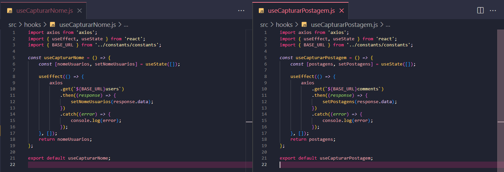

# Template da aula de Custom Hooks

## Índice

-   [1. Prática 1](#1-prática-1)
-   [3. Prática 2](#2-prática-2)
-   [3. Prática 3](#3-prática-3)

## 1 Prática 1

### Enunciado

-   Extraia a lógica das requisições já existentes no template e construa dois custom hooks:
    -   `useCapturarNome` (Custom Hook para Capturar nome das pessoas usuárias)
    -   `useCapturarPostagens` (Custom Hook para Capturar postagens das pessoas usuárias)

### Resolução

-   A ideia é:
    -   Colocar a lógica do arquivo `UserNamesPage.js`, presente antes do retorna da função `UserNamesPage`;
    -   Porque o `jsx` tem como objetivo a renderização;
    -   E tudo que vem **antes** do jsx é a lógica;
    -   Agora o objetivo é deixar a menor quantidade de lógica possível para uma melhor organização do código e também para que ele seja reutilizado.

---

-   Em `src` criei uma pasta chamada `hooks` e dentro dela um arquivo chamado `useCapturarNome.js`;

-   Em `useCapturarNome.js` eu irei colocar toda a lógica que antes estava em `UserNamePage.js`

-   `useCapturarNome.js` possui essa lógica até o momento:

    ```
    import axios from 'axios';
    import { useEffect, useState } from 'react';
    import { BASE_URL } from '../constants/constants';

    const useCapturarNome = () => {
        const [nomeUsuarios, setNomeUsuarios] = useState([]);

        useEffect(() => {
            axios
                .get(`${BASE_URL}users`)
                .then((response) => {
                    setNomeUsuarios(response.data);
                })
                .catch((error) => {
                    console.log(error);
                });
        }, []);
    };

    export default useCapturarNome;

    ```

-   Importante: Não esquecer de fazer as importações de tudo que for preciso para dentro desse novo arquivo!

-   Colocar um retorno dentro da função `useCapturarNome`, nesse retorno eu peço para tudo que eu quero usar:

    ```
    return nomeUsuarios;
    ```

-   Dentro de `UserNamesPage.js` eu importo esse retorno da seguinte forma:
    ```
    const retornoDaFuncao = useCapturarNome();
    ```
-   E agora eu renderizo esse `retornoDaFuncao` no lugar de `nomeUsuarios`

-   no final da criação e exportação do useCapturarNome eu tenho o seguinte código:

    -   arquivo `useCapturarNome.js`:

        ```
        import axios from 'axios';
        import { useEffect, useState } from 'react';
        import { BASE_URL } from '../constants/constants';

        const useCapturarNome = () => {
            const [nomeUsuarios, setNomeUsuarios] = useState([]);

            useEffect(() => {
                axios
                    .get(`${BASE_URL}users`)
                    .then((response) => {
                        setNomeUsuarios(response.data);
                    })
                    .catch((error) => {
                        console.log(error);
                    });
            }, []);
            return nomeUsuarios;
        };

        export default useCapturarNome;
        ```

    -   arquivo `UserNamesPages.js`:

        ```
        import { Title, NameContainer } from '../style';
        import { Card } from '../components/Card/Card';
        import useCapturarNome from '../hooks/useCapturarNome';

        const UserNamesPage = () => {
            const retornoDaFuncao = useCapturarNome();

            return (
                <div>
                    <Title>Nomes dos usuários</Title>
                    <NameContainer>
                        {retornoDaFuncao.map((usuario) => {
                            return (
                                <Card
                                    key={usuario.id}
                                    text={usuario.name}
                                    backgroudColor={'nome'}
                                    textColor={'nome'}
                                />
                            );
                        })}
                    </NameContainer>
                </div>
            );
        };

        export default UserNamesPage;
        ```

    ***

    -   Para `useCapturarPostagem`:
    -   Em `hooks` criei um arquivo chamado `useCapturarPostagens.js`;
    -   Copiei a lógica de `CommentsPages.js` e colei dentro de `useCapturarPostagnes.js`, fiz as importações e o retorno, ficando da seguinte forma:

        ```
        import axios from 'axios';
        import { useEffect, useState } from 'react';
        import { BASE_URL } from '../constants/constants';

        const useCapturarPostagem = () => {
            const [postagens, setPostagens] = useState([]);

            useEffect(() => {
                axios
                    .get(`${BASE_URL}comments`)
                    .then((response) => {
                        setPostagens(response.data);
                    })
                    .catch((error) => {
                        console.log(error);
                    });
            }, []);
            return postagens;
        };

        export default useCapturarPostagem;
        ```

    -   Em `useCapturarPostagem.js`, eu importo e adpto para ser renderizado, ficando na seguinte forma:

        ```
        import { Title, PostContainer } from '../style';
        import { Card } from '../components/Card/Card';
        import useCapturarPostagem from '../hooks/useCapturarPostagem';

        const CommentsPage = () => {
            const postagens = useCapturarPostagem();

            return (
                <div>
                    <Title>Comentários dos usuários</Title>
                    <PostContainer>
                        {postagens.map((post) => {
                            return (
                                <Card
                                    key={post.id}
                                    text={post.body}
                                    backgroudColor={'#1dc690'}
                                    textColor={'#ffffff'}
                                />
                            );
                        })}
                    </PostContainer>
                </div>
            );
        };

        export default CommentsPage;
        ```

## 2 Prática 2

### Enunciado

-   Utilize o exemplo do `useRequestData` do material assíncrono e reorganize o código da prática 1, de modo a permitir a reutilização da lógica para ambas as requisições ao longo do projeto.

### Resolução

-   Código do `useRequestData` do material assíncrono:

    ```
        import React, {useState, useEffect} from 'react'
        import axios from 'axios'

        export function useRequestData(url, initialState) {
            const [data, setData] = useState(initialState)

            useEffect(() => {
                axios.get(url)
                    .then(response => {
                        setData(response.data)
                })
                    .catch(error => console.log(error.response.data)
            )}, [url])

        return data
        }
    ```

-   Analisando os dois `Custom Hooks` criados, percebo que são identicos e apenas o `path` é diferente neles:
    

-   A ideia agora é: Fazer **UM** custom hook genérico para utilizar nos dois casos!

---

-   Em `hooks` criar um arquivo chamado `useRequestData.js`, nesse arquivo eu preciso criar uma função chamada `useRequestData`, nessa função eu adapto um custom hook anteriormente criado para algo mais genérico e que receba um `path` como parâmetro, pois essa é a unica coisa que muda, ficando da seguinte forma:

    ```
    import { useEffect, useState } from 'react';
    import { BASE_URL } from '../constants/constants';
    import axios from 'axios';

    const useRequestData = (path) => {
        const [data, setData] = useState([]);

        useEffect(() => {
            axios
                .get(`${BASE_URL}${path}`)
                .then((response) => {
                    setData(response.data);
                })
                .catch((error) => {
                    console.log(error);
                });
        }, []);
        return data;
    };

    export default useRequestData;

    ```

-   Agora irei fazer a adptação em `UserNamesPage.js` utilizando o `useRequestData.js`:

-   Agora irei substituir o `useCapturanome()` para `useRequestData()`, e preciso passar o parâmetro necessário, agora o `UserNamesPage.js` fica com o seguinte código:

    ```
    import { Title, NameContainer } from '../style';
    import { Card } from '../components/Card/Card';
    import useRequestData from '../hooks/useRequestData';

    const UserNamesPage = () => {
        const retornoDaFuncao = useRequestData('users');
        return (
            <div>
                <Title>Nomes dos usuários</Title>
                <NameContainer>
                    {retornoDaFuncao.map((usuario) => {
                        return (
                            <Card
                                key={usuario.id}
                                text={usuario.name}
                                backgroudColor={'nome'}
                                textColor={'nome'}
                            />
                        );
                    })}
                </NameContainer>
            </div>
        );
    };

    export default UserNamesPage;
    ```

-   Para a página de `CommentsPage.js`, eu faço a mesma adaptação:

    ```
    import { Title, PostContainer } from '../style';
    import { Card } from '../components/Card/Card';
    import useRequestData from '../hooks/useRequestData';

    const CommentsPage = () => {
        const postagens = useRequestData('comments');

        return (
            <div>
                <Title>Comentários dos usuários</Title>
                <PostContainer>
                    {postagens.map((post) => {
                        return (
                            <Card
                                key={post.id}
                                text={post.body}
                                backgroudColor={'#1dc690'}
                                textColor={'#ffffff'}
                            />
                        );
                    })}
                </PostContainer>
            </div>
        );
    };

    export default CommentsPage;

    ```

-   Agora posso excluir os arquivos: `useCapturarNome.js` e `useCapturarPostagem`, e utilizar um único custom hooks para duas requisições diferentes
-   Irei deixar esses dois arquivos para poder consultar depois

## 3 Prática 3

### Enunciado

-   Atualize o `useRequestData` do exercício anterior:
    -   Faça o tratamento de erros: ele deve mostrar uma mesnagem de erro caso a requisição caia no catch.
    -   Adicione um indicador de carregamento: o suário deve saber que os dados estão sendo carregados.
    -   Utilize o nome `isLoading` como variável de estado.

### Resolução
